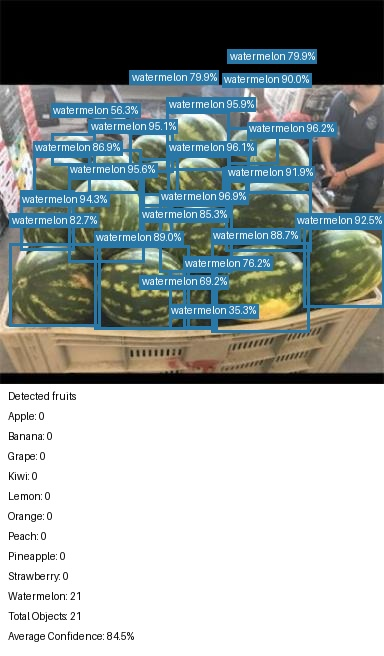

# FruitVision

Multi-Class Fruit Detection, Classification & Size Estimation using YOLO

## Project Overview

FruitVision is a local Python project for detecting **apple, banana, grape, kiwi, lemon, orange, peach,
pineapple, strawberry, and watermelon** in images. Each prediction includes bounding boxes, class
labels, confidence scores, and counts. It is designed as a readable learning
project and a foundation for a technical portfolio.

**Current scope: detection, robustness experiments, approximate size estimation, and the Streamlit dashboard (Phases 1–4).** The local Roboflow Fruit v1 dataset has been imported; dataset files and trained
weights are excluded from Git. The local dashboard brings these modules together using the frozen baseline. The 50-epoch baseline, validation error analysis, and final
held-out evaluation are complete; see [baseline results](docs/BASELINE_RESULTS.md).

## Motivation

This project connects a Data Science / Information Systems background to practical
Computer Vision: preparing labels, fine-tuning a detector, evaluating it fairly,
and understanding its errors. The objective is to understand each pipeline step
before adding an application or more experiments.

## Features

- Ten-class detection with a small pretrained Ultralytics YOLO11n backbone.
- Safe Roboflow import, polygon conversion, and validation of the supplied splits.
- Configurable training with CUDA, Apple MPS, or CPU device selection.
- Annotated prediction images, JSON detection details, and fruit counts.
- Real validation/test precision, recall, F1, and mAP with CSV/JSON exports.
- Evaluation plots from Ultralytics and an optional fruit-count bar chart.
- Validation-only robustness comparisons with fixed brightness, blur, and resolution changes.
- Optional approximate bounding-box widths in centimeters using a user-measured reference.
- A responsive Streamlit dashboard with Detect, Analytics, Model Performance, Robustness, and About.
- Small modules, unexecuted learning notebooks, and focused utility tests.

The detector jointly predicts a class and a box for each object; this phase does
not train a separate image classification model.

## Computer Vision Pipeline

```text
Real images + bounding-box annotations
 → verify YOLO labels
 → preserve supplied train / validation / test split
 → input preprocessing + training-only augmentation
 → fine-tune pretrained YOLO
 → choose best checkpoint using validation
 → evaluate on held-out test data
 → infer on a new image
 → draw boxes + labels + confidence → count fruit
```

Read the code in this order: `import_dataset.py`, `preprocessing.py`, `train.py`, `predict.py`,
`counting.py`, `visualization.py`, then `evaluate.py`.

## Dataset

The baseline uses **Fruit v1**, exported from Roboflow workspace
`simons-workspace-l89qb`, project `fruit-smrhb-tp0nb`, under **CC BY 4.0**.
The local `Fruit.v1i.yolov11.zip` contains **2,217 images**. The importer preserves
its supplied split; it does **not** randomly re-split, balance, or augment the data.

| Split | Images / label files | Standard boxes | Converted polygons | Objects |
| --- | ---: | ---: | ---: | ---: |
| Train | 1,550 | 3,271 | 134 | 3,405 |
| Validation (`valid` → `val`) | 430 | 865 | 15 | 880 |
| Test | 237 | 426 | 13 | 439 |
| **Total** | **2,217** | **4,562** | **162** | **4,724** |

These counts were calculated from the local archive, not inferred from expected
values. All images decode at 384×384. Roboflow's metadata records auto-orientation
and stretch resizing to this size, with no export-time augmentation. Training at
640 pixels upsamples these images; it cannot recover detail lost during export.

```bash
python src/import_dataset.py --zip ~/Downloads/Fruit.v1i.yolov11.zip
python src/preprocessing.py validate
```

The importer inspects archive paths, metadata, class IDs, paired files, image
readability, annotation coordinates, and duplicate content. It stages and validates
the entire dataset before copying it into `data/processed/`. Existing nonempty
datasets are protected. The original ZIP is read-only throughout import. To import
again, choose a new `--output` and `--audit` path and update the dataset config.

Outputs:

- `outputs/dataset_audit.json`: calculated counts, conversions, missing/invalid files,
  duplicate groups, source metadata, and the source ZIP SHA-256 fingerprint.
- `outputs/figures/dataset_class_distribution.png`: real annotation counts.
- `data/processed/import_manifest.json`: import provenance.
- `data/processed/source_metadata/`: original YAML and both Roboflow README files.

The archive contains three **identical** `data.yaml` entries. The importer verifies
that their bytes agree, records the repetition, and retains one metadata copy.
Conflicting metadata or duplicate image/label destination paths are rejected.

### Baseline dataset correction

Before the 50-epoch baseline, one exactly duplicated apple annotation was removed
from the processed training label. The source ZIP remains unchanged. The current
processed dataset has **4,723 objects**: 3,404 train, 880 validation, and 439 test;
apple has 272 objects across splits. The source-count tables below retain the
original archive statistics (4,724 rows).

The empty orange label could not be reliably recovered: it is also empty in the
ZIP, no alternate annotation is included, and the public Roboflow page returned
an access challenge. It remains unchanged; no bounding box was guessed.

- Correction log: `outputs/dataset_corrections.json`.
- Current audit: `outputs/dataset_audit_baseline.json` (per-file hashes included).
- Recheck: `python src/audit_dataset.py` and `python src/preprocessing.py validate`.

### Class distribution and quality notes

| ID | Class | Objects |
| --- | --- | ---: |
| 0 | apple | 273 |
| 1 | banana | 269 |
| 2 | grape | 431 |
| 3 | kiwi | 593 |
| 4 | lemon | 224 |
| 5 | orange | 424 |
| 6 | peach | 235 |
| 7 | pineapple | 321 |
| 8 | strawberry | 955 |
| 9 | watermelon | 999 |

Watermelon has about **4.46×** as many annotations as lemon. More frequent classes
contribute more training examples, but frequency did not predict performance simply:
lemon performs strongest despite its low frequency. See the per-class analysis. No oversampling or balancing
has been applied.

The audit found no missing pairs, invalid coordinates, out-of-range IDs, unreadable
images, or exact/decoded-pixel duplicates **across** splits. It found two duplicate
image pairs **within** splits (one train, one validation) with different labels.
The training pair has substantially different apple boxes. It also found one empty
training label; visual inspection shows orange fruit in that image, so this is a
likely missing annotation, not a verified negative example. One training label also repeats the same full-image apple box twice. Both rows were retained during the initial import and counted in the source audit.
The redundant row was removed from the processed copy before baseline training;
there are now **3,404 training annotations**, matching the effective object count
used by the earlier sanity run.
The remaining source-quality
issues are preserved and disclosed for this baseline; address them in a
separately versioned dataset before making strong performance claims.

See [data/README.md](data/README.md) for the exact layout, polygon conversion, and
reproducibility details. The general-purpose random splitter remains available
for other datasets, but **must not be used on this already split Roboflow dataset**.

## Dataset Attribution

**Fruit**, Roboflow workspace `simons-workspace-l89qb`, project
`fruit-smrhb-tp0nb`, version **1**. Provided by a Roboflow user; the export does not
supply a separate author name. Source:
[Roboflow Fruit v1](https://universe.roboflow.com/simons-workspace-l89qb/fruit-smrhb-tp0nb/dataset/1).
License: [Creative Commons Attribution 4.0 International](https://creativecommons.org/licenses/by/4.0/).

FruitVision changes the export layout (`valid` to `val`) and converts 162 polygon
annotations into enclosing axis-aligned bounding boxes for object detection.
Image bytes, class IDs, original split membership, and source attribution are
preserved. Source ZIP SHA-256:
`678be4a962f09ed357b67ec0344bf07002f9f465632ae3b66d068f523ad46013`.

## YOLO Annotation Format

Each object occupies one line in the image's label file:

```text
<class_id> <x_center> <y_center> <width> <height>
```

IDs follow the exact ten-class table above; they are never reordered. The four box values
are normalized to `[0, 1]` using the original image width and height. Width/height
must be positive. A box describes a rectangle around one object, not its precise
outline. The [dataset guide](data/README.md#yolo-annotation-format) provides the
pixel-to-normalized conversion formulas.

Some source lines use `class_id x1 y1 x2 y2 ... xn yn`. The importer takes the
minimum/maximum x and y values, then derives center, width, and height. It requires
at least three complete, finite coordinate pairs inside `[0, 1]` and a positive
resulting width/height. It does not clip, drop, or relabel polygons. Only the
processed copy changes; all output annotations have exactly five values.

## Project Structure

The workspace directory is the repository root (you can name it `fruitvision-yolo`).

```text
fruitvision-yolo/
├── README.md
├── requirements.txt
├── .gitignore
├── docs/BASELINE_RESULTS.md          # real baseline results and error analysis
├── configs/dataset.yaml
├── data/
│   ├── README.md
│   ├── raw/
│   └── processed/{images,labels}/{train,val,test}/
├── examples/                         # place your inference images here
├── notebooks/
│   ├── 01_dataset_exploration.ipynb
│   └── 02_model_evaluation.ipynb
├── src/
│   ├── __init__.py
│   ├── common.py                    # shared paths, device/model checks
│   ├── import_dataset.py            # safe ZIP import and polygon conversion
│   ├── preprocessing.py             # annotation checks and optional general splitter
│   ├── audit_dataset.py             # processed counts, label issues, content hashes
│   ├── error_analysis.py            # inspect saved evaluation predictions
│   ├── train.py                     # transfer learning and checkpoint resume
│   ├── predict.py                   # inference and result extraction
│   ├── counting.py                  # model-independent summaries
│   ├── size_estimation.py           # optional reference scale and approximate widths
│   ├── visualization.py             # annotated images and count charts
│   └── evaluate.py                  # real metrics and CSV/JSON export
├── tests/                           # pipeline and importer tests
├── experiments/                     # frozen-model validation robustness
│   ├── brightness_test.py
│   ├── blur_test.py
│   ├── resolution_test.py
│   └── experiment_runner.py
├── app/
│   ├── app.py                       # Streamlit navigation and page rendering
│   ├── helpers.py                   # upload, prediction adapters, saved-result loading
│   └── styles.css                   # custom dashboard styling
├── .streamlit/config.toml            # theme and local-only server defaults
└── outputs/
    ├── training/                    # checkpoints and run configuration
    ├── predictions/
    ├── metrics/
    └── figures/
```

Empty folders use `.gitkeep`. Model code stays in `src/`; web presentation stays in `app/`.

## Installation

Use Python 3.10 or newer; Python 3.11/3.12 are reasonable starting environments.
Run commands from the repository root:

```bash
python3 -m venv .venv
source .venv/bin/activate
python -m pip install --upgrade pip
python -m pip install -r requirements.txt
```

On Windows, activate with `.venv\Scripts\activate` instead. GPU support depends on
your PyTorch build and hardware; see the official [PyTorch installation selector](https://pytorch.org/get-started/locally/)
if CUDA is unavailable. `--device cpu` is a portable fallback, but training is slower.

Only directly used dependencies are listed. Ultralytics also installs its own
dependencies, including NumPy and OpenCV. Streamlit is the only added UI dependency. To run notebooks,
use your editor's Python notebook support, or optionally install Jupyter with
`python -m pip install notebook`.

Ultralytics is pinned to `8.4.152` so the result and metric interfaces match the
version used to check this project. Record the rest of your environment for each run.

```bash
python -m unittest discover -s tests -v
python src/train.py --help
```

## Training

```bash
python src/preprocessing.py validate
python src/train.py --epochs 5 --img-size 640 --batch-size 8 --name sanity_10class
```

The default `yolo11n.pt` checkpoint is a small pretrained detector supported by
[Ultralytics YOLO11](https://docs.ultralytics.com/models/yolo11/). The first training
run may download these pretrained weights; it does not download a fruit dataset.
For offline use, supply a local pretrained checkpoint with `--model path/to/yolo11n.pt`.
The original pretrained classes are not a trained ten-class FruitVision model.

- **Transfer learning:** reuse learned visual features, then fine-tune on fruit labels.
- **Epoch:** one pass through the training set. More epochs do not guarantee improvement.
- **Batch size:** images per gradient update; reduce it if memory runs out.
- **Image size:** target input resolution; larger images cost more computation.
- **Augmentation:** training flips, color variation, and mosaic encourage generalization.

Ultralytics handles resizing/padding, tensor conversion, and pixel scaling. Do not
manually resize labels independently. For the named sanity run, its best validation checkpoint is saved at:

```text
outputs/training/sanity_10class/weights/best.pt
```

`last.pt`, training curves, `results.csv`, and resolved arguments are also saved.
Our run metadata records package versions, the seed, device, and class counts.
See [Ultralytics training documentation](https://docs.ultralytics.com/modes/train/)
for details of its training outputs and settings.

Use a new name for another run; existing runs are protected:

```bash
python src/train.py --epochs 5 --batch-size 4 --device cpu --name cpu_trial
```

Then pass `--weights outputs/training/cpu_trial/weights/best.pt` to prediction and
evaluation. A short trial verifies the workflow, not model quality. Early stopping
may end longer runs before the requested maximum epochs. Seeds improve
reproducibility, but hardware and library versions can still change results. This
MPS run warns that some scatter/index operations are not fully deterministic
even with deterministic mode requested; bit-for-bit repeatability is not guaranteed.
The training script saves `pip freeze` in each run's `environment.txt`.

### Completed baseline

The baseline completed all 50 epochs on Apple M2 MPS using this command:

```bash
python src/train.py --epochs 50 --img-size 640 --batch-size 8 --name fruitvision_baseline
```

Batch 8 leaves more memory headroom than 16 on shared-memory hardware. Automatic
selection uses MPS when available; use `--device cpu` if MPS is unavailable. The
baseline is complete; this command is recorded for reproducibility, not a request
to rerun it. Existing named folders are protected. Prediction/evaluation now default
to `outputs/training/fruitvision_baseline/weights/best.pt`. The training script saves
`environment.txt` (`pip freeze`) and run metadata automatically. Training resumed
from its own checkpoint after an interruption; see the detailed results for timing
and reproducibility limitations.

## Running Inference

Supply your own image; `examples/fruits.jpg` is a suggested location, not a bundled file.

```bash
python src/predict.py --image examples/fruits.jpg --weights outputs/training/fruitvision_baseline/weights/best.pt
python src/predict.py --image examples/fruits.jpg --weights outputs/training/fruitvision_baseline/weights/best.pt --plot-counts
```

The console reports all ten counts, total objects, and average confidence based
on actual detections. The outputs are:

- `outputs/predictions/fruits_annotated.jpg`: boxes, labels, confidence, count footer.
- `outputs/predictions/fruits_detections.json`: pixel boxes, class IDs/names, scores, summary.
- `outputs/predictions/fruits_counts.png`: optional count chart.

No detections gives zero counts and an `N/A` average (`null` in JSON). Confidence
is a model score, **not measured accuracy** or a guaranteed probability of correctness.
Raising the threshold often reduces false positives while increasing missed fruit.
Prediction JSON also includes `summary.inference_time_ms`: wall time for the prediction
call and result extraction, excluding model loading; the first call can include warm-up.
Counts refer to retained boxes in one image; this is not object tracking.
Repeated predictions with the same filename stem replace those output files;
use `--output-dir` to preserve separate comparisons.

## Model Evaluation

Tune settings using validation. Reserve test for a final assessment:

```bash
python src/evaluate.py --weights outputs/training/fruitvision_baseline/weights/best.pt --batch-size 8 --split val --name baseline_validation
python src/evaluate.py --weights outputs/training/fruitvision_baseline/weights/best.pt --batch-size 8 --split test --name baseline_test
```

These named evaluations have already completed and will not be overwritten.
Inspect the saved results rather than repeatedly evaluating test while tuning.

The full dataset layout is checked before evaluation, including exact cross-split
duplicates. Exports go to `outputs/metrics/fruitvision_test/` by default:
`metrics.json`, `summary.csv`, `per_class.csv`, a resolved dataset config, and
Ultralytics plots such as the confusion matrix and precision-recall curves.

| Concept | Meaning |
| --- | --- |
| IoU | Intersection over Union: box overlap area divided by their combined area. |
| Precision | `TP / (TP + FP)`: how many reported objects are correct. |
| Recall | `TP / (TP + FN)`: how many labeled objects are found. |
| F1 | `2PR / (P + R)`: balances precision and recall. |
| AP | Area under a class's precision-recall curve as confidence varies. |
| mAP@50 | Mean AP across evaluated classes, matching boxes at IoU ≥ 0.50. |
| mAP@50-95 | Mean AP across classes and IoU thresholds 0.50–0.95 in steps of 0.05. |

TP is a correct class/box match; FP is an unmatched or wrong detection; FN is a
missed labeled object. Matching requires the correct class and sufficient box
overlap; one ground-truth object cannot justify multiple true positive detections.

Precision/recall/F1 are taken at Ultralytics' operating point selected for best
mean F1 at IoU 0.5; they are not fixed at the inference threshold of 0.25. Overall
F1 averages per-class F1. Classes absent from ground truth have `null` per-class
metrics and are excluded from the macro averages; missing classes limit conclusions.
AP uses a low confidence floor (0.001) to retain the precision-recall curve.
Consult the [Ultralytics metric reference](https://docs.ultralytics.com/reference/utils/metrics/)
and [validation guide](https://docs.ultralytics.com/modes/val/) for the upstream definitions.

For error analysis, inspect missed small/occluded fruits, duplicate boxes, class
confusions, and false detections on backgrounds. Compare predictions with labels;
an annotation mistake can appear to be a model error. Do not select thresholds
or repeatedly tune the model based on the held-out test set.

## Robustness Experiments

Phase 2 evaluates the **same frozen baseline checkpoint** on all 430 validation
images under five prespecified conditions. It does not train or tune the model,
change labels, or evaluate the test split.

| Condition | Fixed transformation before YOLO preprocessing |
| --- | --- |
| Normal | Identity, decoded RGB pixels preserved |
| Dark | Brightness ×0.5 |
| Bright | Brightness ×1.5, clipping at 255 |
| Blur | Pillow Gaussian blur radius 2 source-image pixels |
| Low resolution | Resize to 25% width/height with BOX, then restore with BILINEAR |

The 384×384 source images become 96×96 temporarily for the resolution condition.
All variants retain the original canvas, so normalized boxes remain aligned.
Every condition uses lossless PNG copies and byte-identical labels in a separate
output directory; the source dataset and checkpoint are fingerprinted before/after.

```bash
python experiments/experiment_runner.py
```

Defaults: `outputs/training/fruitvision_baseline/weights/best.pt`, validation only,
640 input, batch 8, seed 42, automatic MPS/CUDA/CPU selection. Existing output
folders are protected; use `--output` with a new path for an explicitly planned run.

Results go to `outputs/experiments/robustness/`: `overall.csv`, `per_class.csv`,
`results.json`, per-condition evaluation exports, transformation manifests,
comparison figures, run metadata, and `environment.txt`.
Relative degradation is `100 × (normal − condition) / normal`; negative values
indicate improvement. Percentage-point drops are saved separately. mAP50–95 is
the prespecified primary comparison. Precision/recall/F1 use the same Ultralytics
reporting convention as the baseline, not a shared deployment confidence threshold.

See [Robustness Results](docs/ROBUSTNESS_RESULTS.md) for measured results and
per-class comparisons. Source annotations are imperfect, so these are **diagnostic
robustness results**, not clean ground-truth guarantees or severity-independent rankings.

In the completed run, low resolution reduced mAP50–95 from **71.08% to 64.45%**
(**9.33% relative degradation**); blur was close at **64.69%**. Pineapple showed
the largest per-class loss. All **46 tests passed**, including ten robustness tests.

## Size Estimation

Phase 3 optionally converts detected horizontal bounding-box widths into
**approximate centimeters** using a known reference in the same image:

```text
cm_per_pixel = known_reference_width_cm / reference_width_pixels
approximate_width_cm = (fruit_x2 - fruit_x1) * cm_per_pixel
```

Supply a measured physical width plus either a pixel width or reference box.
The following numbers are an arithmetic illustration, not measurements of a
bundled image; replace them with values measured in your own reference photo:

```bash
python src/predict.py --image examples/fruit_with_reference.jpg \
  --reference-width-cm 8.56 --reference-width-pixels 250 \
  --output-dir outputs/predictions/with_size
```

Alternatively, use `--reference-bbox X1 Y1 X2 Y2` instead of
`--reference-width-pixels`. Coordinates must be pixels in the **EXIF-oriented
original image**, not a resized preview or YOLO's internal input. The existing
frozen baseline is used without retraining; the reference is provided manually.

For illustration, 8.56 cm / 250 pixels gives 0.03424 cm/pixel. A 200-pixel fruit
box would therefore have an **approximate box width of 6.85 cm**. This is **not
necessarily the fruit's true diameter**. Reference placement, perspective, depth,
orientation, camera distance, lens distortion, and detection errors limit accuracy.

With a reference, JSON includes top-level calibration metadata and a
`size_estimation` entry for each detection; the console labels widths approximate.
Without a reference, prediction behavior and JSON fields remain unchanged.
Annotated images retain their existing detection/count display. Partial or invalid
reference data is rejected before inference. No physical-accuracy results are
claimed: the dataset has no verified size ground truth.

See [Size Estimation](docs/SIZE_ESTIMATION.md) for setup, both CLI modes, JSON fields,
limitations, and validation guidance. The full suite passes **61 tests**, including
15 new size-estimation tests. No UI or additional dependency was added.

## Web Application

Launch from the project root with the virtual environment activated:

```bash
source .venv/bin/activate
python -m pip install -r requirements.txt
streamlit run app/app.py
```

Open **http://127.0.0.1:8501**. The custom dashboard uses a navy sidebar, a light
workspace, responsive layouts, and five sections:

| Page | What it shows |
| --- | --- |
| Detect | JPG/PNG upload, original/result previews, confidence control, boxes, counts, timing, detection table, optional approximate size, JSON/image downloads |
| Analytics | Current prediction's fruit counts, class shares, confidence distribution, and object details |
| Model Performance | Saved validation/test aggregate and per-class metrics, confusion matrix, and training curves |
| Robustness | Saved normal/dark/bright/blur/low-resolution results, degradation, and class sensitivity |
| About | Project context, interpretation, limitations, dataset attribution, and session behavior |

The app calls the existing prediction, counting, visualization, and size-estimation
pipeline. The model is cached with a lock for shared access. Changing image,
confidence, or reference settings clears stale results; navigation retains the
current image and controls. No retraining or evaluation runs are launched from the UI.

The frozen checkpoint must exist at
`outputs/training/fruitvision_baseline/weights/best.pt` for detection. Saved metrics
are read from `outputs/` first, with curated `docs/results/` exports as a fallback.
Missing or malformed results are reported rather than replaced with sample metrics.

Uploads are limited to **JPG/PNG, 10 MB, 20 megapixels** and held in session memory.
The app does not write uploads into the dataset or send them to an external service.
Download results to retain them. The server binds to localhost by default; this is
a local application without authentication or a persistent multi-user result store.

See [Web Application Guide](docs/WEB_APPLICATION.md) for architecture, checks,
troubleshooting, and limitations. **82 tests passed**, covering the existing pipeline,
UI, close-up preparation, and fine-tuning settings. Desktop/mobile browser checks verified real
inference, result downloads, and navigation. The baseline checkpoint remains unchanged.

The Detect page now shows the result directly and only lists classes that were
detected. Threshold controls, the original photo, and technical details are available
in expanders. Annotation text scales with image size so phone-photo labels remain readable.

### Real-world photo review

A supplied close-up banana photo exposed a banana/lemon error despite strong
in-dataset banana metrics. Two fine-tuning attempts were recorded; the completed
close-up candidate still produced an incorrect lemon detection and reduced validation
mAP50–95 from **71.08% to 59.99%**. It was **not deployed**. The app retains the
baseline, so the reported banana error remains unresolved. See
[the evidence and next data-collection step](docs/REAL_WORLD_REVIEW.md).

## Results

The **YOLO11n baseline completed 50 epochs** on Apple M2 MPS (640 input, batch 8, seed 42). Validation review preceded one final test evaluation; no test-driven tuning was performed.

| Split | Images | mAP@50 | mAP@50–95 |
| --- | ---: | ---: | ---: |
| Validation | 430 | 88.55% | 71.08% |
| Held-out test | 237 | 94.96% | 77.93% |

Lemon, banana, and peach perform strongest; grape remains the main recurring weakness. Small/occluded fruit and incomplete annotations complicate error counts. The curves show no obvious sustained overfitting. All **36 tests passed**, and the corrected dataset passed validation with **4,723 objects**. Utility tests verify software behavior, not model accuracy.

See [Baseline Results](docs/BASELINE_RESULTS.md) for precision/recall/F1, per-class tables, confusion matrices, real failures, training curves, timing, and reproducibility. Curated JSON/CSV evidence lives in `docs/results/`; checkpoints and large artifacts remain under ignored `outputs/`.

**Real held-out example — crowded watermelons:**



The model retains 21 boxes against 20 annotations here, including one unmatched prediction. A [challenging pineapple example](docs/assets/test_false_negatives.jpg) is also documented. Source imagery: Roboflow Fruit v1, CC BY 4.0; FruitVision adds prediction overlays (see Dataset Attribution).

## Limitations

- Requires real, consistently labeled fruit bounding boxes and sufficient diversity.
- Small/occluded fruits, unusual backgrounds, lighting, and similar colors can cause errors.
- Class imbalance and related images across splits can distort performance estimates.
- Bounding boxes can overlap and do not describe precise object shapes.
- CPU training may be slow; no speed or accuracy target is promised.
- Ten classes only; physical measurements and video tracking are not in Phase 1.

## Future Improvements

1. Review incomplete/inconsistent labels in a separately versioned dataset; preserve this baseline.
2. Use the measured Phase 2 results to plan a prespecified severity sweep after annotation review.
3. Validate approximate size estimates against real reference photos and independent physical measurements.
4. Refine the dashboard using feedback from real users; add deployment controls only if hosting is needed.

## Skills Demonstrated

Dataset preparation, normalized bounding boxes, transfer learning, object detection,
data augmentation, reproducible experiments, Python modularity, model evaluation,
visualization, error analysis, and reference-based approximate measurement.

### Phase 1 learning checklist

- Convert a pixel box into YOLO coordinates and explain each value.
- Explain why validation and test have different jobs and how leakage occurs.
- Explain how pretrained weights and augmentation help with limited data.
- Follow one YOLO result into a plain detection dictionary, annotation, and count.
- Explain why confidence, precision, recall, and mAP answer different questions.
- Inspect real false positives/negatives and propose one justified improvement.
