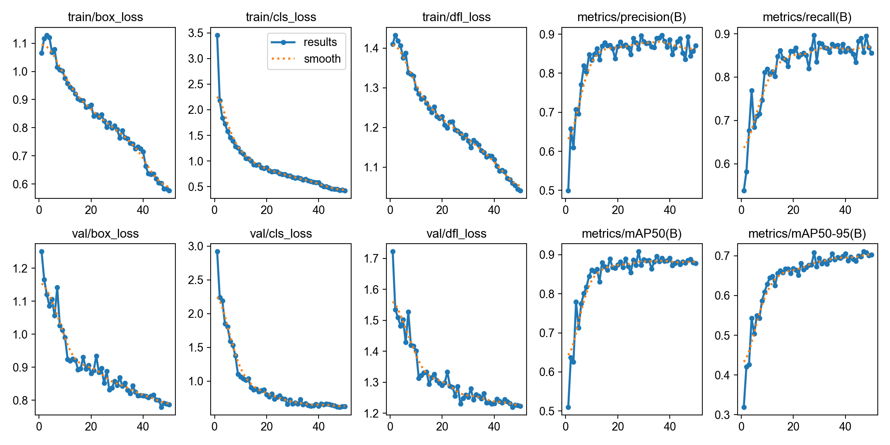
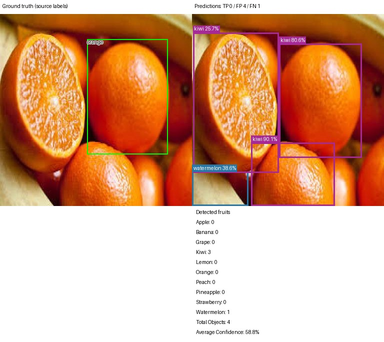
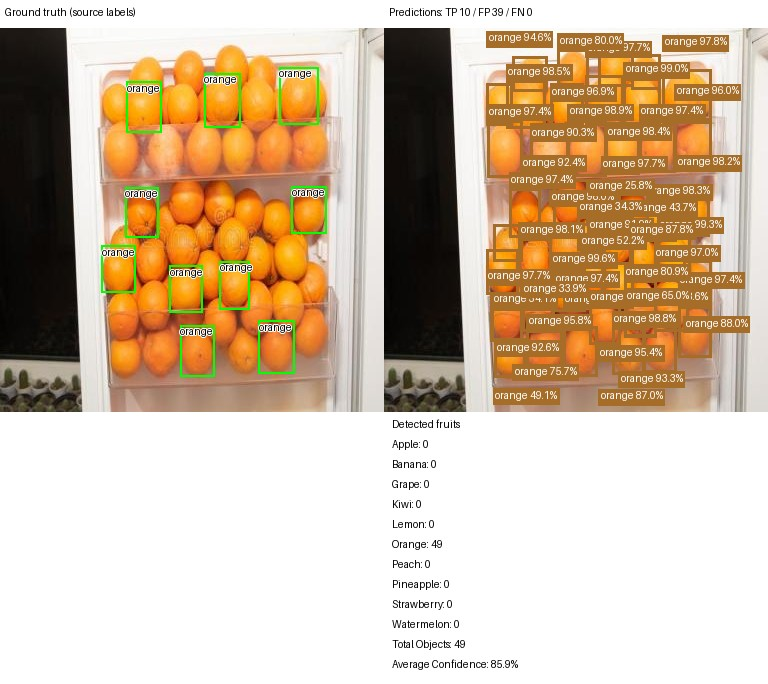
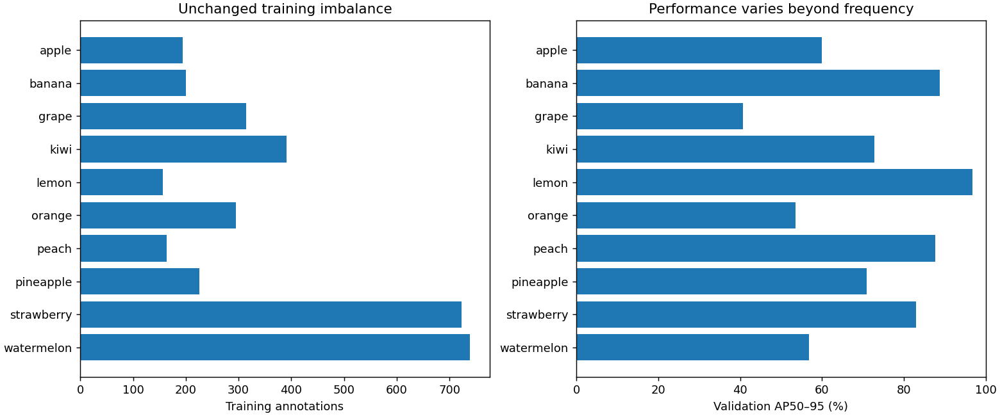

# FruitVision Baseline Results

Completed training: 15 September 2026 UTC. Validation analysis and final test evaluation: 16 September 2026 UTC.
This is the first 50-epoch baseline, not the five-epoch sanity model. Every reported metric comes from real evaluation.

## Baseline Configuration

| Setting | Value |
| --- | --- |
| Model | Ultralytics YOLO11n, initialized from pretrained `yolo11n.pt` |
| Dataset | Roboflow Fruit, workspace `simons-workspace-l89qb`, project `fruit-smrhb-tp0nb`, version 1, CC BY 4.0 |
| Images | 2,217: 1,550 train / 430 validation / 237 test |
| Effective annotations | 4,723: 3,404 train / 880 validation / 439 test |
| Classes, by ID 0–9 | apple, banana, grape, kiwi, lemon, orange, peach, pineapple, strawberry, watermelon |
| Input size / batch | 640 / 8 |
| Epochs requested / completed | 50 / 50; no early stopping (patience 100) |
| Device | Apple M2 MPS, 8 GiB shared system memory |
| Seed | 42; deterministic mode requested, with MPS nondeterminism warnings |
| Software | Python 3.13.5; Ultralytics 8.4.152; PyTorch 2.14.0 |
| Optimizer | Existing `auto` setting selected AdamW, initial LR 0.000714, momentum 0.9 |
| Augmentation | Existing Ultralytics defaults; mosaic closes for final 10 epochs |
| Best epoch | 47, highest recorded validation mAP50–95 |
| Completed-epoch training time | 8,193.52 seconds, approximately 2 h 16 min 34 s |
| Wall time including interruption | Approximately 4 h 45 min 24 s |

The original process stopped after 26 completed epochs. Its cause was not established. Training resumed from its own `last.pt` with saved optimizer/configuration after verifying the dataset fingerprint, then completed epochs 27–50. This was continuation of the same experiment. The CSV timer resets on resume; reported training time sums both completed-epoch segments and excludes interruption and any unrecorded partial epoch.

Original command (already completed; do not overwrite the run):

```bash
python src/train.py --epochs 50 --img-size 640 --batch-size 8 --name fruitvision_baseline
```

Both checkpoints exist and load successfully with the exact ten-class mapping:

- `outputs/training/fruitvision_baseline/weights/best.pt`
- `outputs/training/fruitvision_baseline/weights/last.pt`

Best checkpoint SHA-256: `52a50db1f0c3e7384040359887683bfdaa764ae996c72e87fd7f194064430d3c`.

No architecture change, hyperparameter search, oversampling, class weighting, or new custom augmentation was applied. Validation selected the checkpoint. The test split was never used for training or tuning.

## Dataset Quality Notes

The source ZIP `/Users/vdr/Downloads/Fruit.v1i.yolov11.zip` remains unchanged. Its hash was rechecked after evaluation: `678be4a962f09ed357b67ec0344bf07002f9f465632ae3b66d068f523ad46013`.

| File in processed training labels | Before | Action and after | Reason |
| --- | --- | --- | --- |
| `-00098_jpeg_jpg.rf.aec4825c02cae8aecba83b0e528e6a0a.txt` | Two identical `0 0.5 0.5 1 1` rows | Removed only second row; one remains | Exactly redundant apple box, confirmed in source |
| `img_411_jpeg.rf.594874dd52557bd505fa98f2fa77b9a3.txt` | Empty despite visible orange | Left image and empty label unchanged | Original ZIP label also empty; no alternate annotation metadata in ZIP; public Roboflow page returned an access challenge. No reliable box recovered |

See the [machine-readable correction log](results/dataset_corrections.json). The importer previously converted all 162 polygons into enclosing detection boxes; none was discarded. The archive has 4,724 source rows, and the corrected baseline has 4,723 effective rows.

Final validation and audit passed: all 2,217 images have label files; coordinates and class IDs are valid; no missing pairs, unreadable images, remaining duplicate annotation rows, or exact/decoded-pixel duplicates across splits. Two duplicate image pairs **within** splits have different labels and remain unchanged. One empty training label remains. Passing structural validation does not prove semantic annotation correctness.

Further visual review found incomplete validation annotations (notably the refrigerator full of oranges) and inconsistent coverage in crowded scenes. These were documented, not edited after training. The corrected dataset fingerprint is `6a89fedd2e617b3b22cdef23043cf38c7f519bc09f585245a38284f156eadf04` and still matches the training snapshot.

## Validation Results

Evaluated on 430 images / 880 labeled objects using `best.pt`. Validation review was completed and recorded before requesting test evaluation.

| Metric | Value |
| --- | ---: |
| Precision | 89.36% |
| Recall | 85.77% |
| F1 | 86.78% |
| mAP@50 | 88.55% |
| mAP@50–95 | 71.08% |

Source: [validation metrics](results/validation_metrics.json).

## Test Results

One final held-out evaluation on 237 images / 439 labeled objects, with the same checkpoint and evaluation settings. No subsequent model or threshold tuning was performed.

| Metric | Value |
| --- | ---: |
| Precision | 91.31% |
| Recall | 92.03% |
| F1 | 91.37% |
| mAP@50 | 94.96% |
| mAP@50–95 | 77.93% |

Source: [test metrics](results/test_metrics.json). Test scores exceed validation scores; these are different, relatively small samples. This does not establish stronger generalization to arbitrary photos. The three earlier sanity-stage test-image checks are disclosed in the integration report; this test split was not completely unseen during pipeline development, although its metrics were not used for tuning.

### Metric interpretation

Precision, recall, and F1 are macro averages across classes at Ultralytics' best-mean-F1 operating point on each evaluated split. Overall F1 is the mean of class F1 values, not the harmonic mean of the displayed aggregate precision and recall. This reporting convention does not select a deployment threshold from test data. AP integrates the precision–recall curve with confidence floor 0.001. AP50–95 also requires increasingly precise box overlap, so it is lower than AP50.

The separate diagnostic review uses fixed confidence 0.25 and IoU 0.50 with greedy class-aware matching. Its TP/FP/FN counts are descriptive and are not interchangeable with the official AP calculation or optimal-F1 metrics.

## Per-Class Results

All metric columns below are percentages; object counts are ground-truth annotations on the evaluated split.

### Validation

| ID | Class | Objects | Precision | Recall | F1 | AP50 | AP50–95 |
| --- | --- | ---: | ---: | ---: | ---: | ---: | ---: |
| 0 | apple | 54 | 100.00 | 76.25 | 86.52 | 88.68 | 59.88 |
| 1 | banana | 45 | 96.06 | 100.00 | 97.99 | 99.41 | 88.79 |
| 2 | grape | 79 | 82.76 | 48.62 | 61.25 | 68.69 | 40.74 |
| 3 | kiwi | 133 | 83.28 | 86.47 | 84.84 | 92.39 | 72.76 |
| 4 | lemon | 43 | 99.37 | 100.00 | 99.69 | 99.50 | 96.75 |
| 5 | orange | 90 | 69.10 | 86.67 | 76.89 | 68.94 | 53.47 |
| 6 | peach | 44 | 96.95 | 100.00 | 98.45 | 99.50 | 87.66 |
| 7 | pineapple | 59 | 81.54 | 88.14 | 84.71 | 89.65 | 70.95 |
| 8 | strawberry | 177 | 96.58 | 97.18 | 96.88 | 99.23 | 82.93 |
| 9 | watermelon | 156 | 87.95 | 74.36 | 80.59 | 79.52 | 56.85 |

### Held-out test

| ID | Class | Objects | Precision | Recall | F1 | AP50 | AP50–95 |
| --- | --- | ---: | ---: | ---: | ---: | ---: | ---: |
| 0 | apple | 24 | 91.60 | 95.83 | 93.67 | 96.83 | 75.70 |
| 1 | banana | 24 | 98.94 | 100.00 | 99.47 | 99.50 | 91.40 |
| 2 | grape | 37 | 84.40 | 73.13 | 78.36 | 82.33 | 50.01 |
| 3 | kiwi | 69 | 90.69 | 84.06 | 87.25 | 94.46 | 75.81 |
| 4 | lemon | 24 | 98.45 | 100.00 | 99.22 | 99.50 | 96.80 |
| 5 | orange | 39 | 87.92 | 100.00 | 93.57 | 98.69 | 79.63 |
| 6 | peach | 27 | 98.63 | 100.00 | 99.31 | 99.50 | 88.24 |
| 7 | pineapple | 36 | 96.52 | 77.01 | 85.66 | 88.01 | 68.22 |
| 8 | strawberry | 55 | 81.49 | 96.05 | 88.17 | 97.77 | 81.12 |
| 9 | watermelon | 104 | 84.45 | 94.23 | 89.07 | 92.98 | 72.37 |

By AP50–95, **lemon, banana, and peach** are strongest on both splits. Validation is weakest for **grape, orange, and watermelon**; test is weakest for **grape, pineapple, and watermelon**. Grape remains the clearest recurring weakness. Orange improves substantially on test; the incomplete validation labels and different image conditions caution against treating this difference as a model change.

## Training Behavior



| Loss | First epoch | Last epoch |
| --- | ---: | ---: |
| Train box | 1.06539 | 0.57625 |
| Train classification | 3.45637 | 0.42049 |
| Train distribution focal loss | 1.41009 | 1.04067 |
| Validation box | 1.25075 | 0.78654 |
| Validation classification | 2.91877 | 0.62799 |
| Validation distribution focal loss | 1.72197 | 1.22349 |

Box loss measures localization error; classification loss measures class prediction error; distribution focal loss helps learn precise box boundaries. All three training and validation losses decreased overall. Precision/recall improved early and fluctuated later. AP50 largely plateaued near 0.88 after about 20 epochs. Mean AP50–95 rose from 0.6926 in epochs 31–40 to 0.6983 in the last ten epochs, indicating smaller continued gains. The training-loss drop near epoch 41 coincides with the existing mosaic schedule.

There is **no obvious sustained overfitting** in these curves: validation losses do not show persistent divergence while training loss falls. Minor fluctuations do not establish instability or overfitting, and this single split/run cannot rule either out. See [all 50 CSV rows](results/results.csv) and [curve summary](results/training_behavior.json).

## Error Analysis

Validation predictions were saved during the original evaluation and inspected without rerunning it. Selection includes first single/multiple-object examples, crowded/small-object cases, highest-error cases, and a confirmed wrong-class overlap; it is not a gallery of only good results.

At confidence 0.25 / IoU 0.50, the diagnostic matcher counts **798 TP, 258 FP, and 82 FN** relative to the labels. These numbers include annotation defects:

- **True positives:** the inspected isolated apple is detected at 98.0% confidence; 18 of 21 annotated watermelons in a tightly packed image are matched.
- **False negatives:** a watermelon field has 5 TP and 14 FN; distant fruit and foliage obscure small objects. Boxes occupying less than 1% of image area have 28 misses among 50 objects (56%), versus 54/830 (6.5%) for larger boxes. This is a project-specific area threshold, not COCO's size definition.
- **Crowding:** 40 validation images with at least five annotated objects contain 55 misses among 376 objects (14.6%), versus 27/504 (5.4%) elsewhere. Size, background, and occlusion overlap with crowding; this is association, not proof of cause.
- **Extra/duplicate predictions:** both grape bunches in one example are detected, but an additional overlapping pineapple box appears at 33.6%. Large foreground watermelons also attract extra boxes. Wrong-class extra predictions can occur even when the correct detection is present.
- **Incomplete labels:** the orange refrigerator yields 10 TP and 39 FP relative to its ten annotations. Many extra detections align with visibly real, unlabeled oranges. They must not all be interpreted as background hallucinations.
- **Confirmed class confusion:** three unmatched orange/kiwi pairs appear in the fixed-threshold analysis. The inspected example below contains an actual orange labeled orange, predicted kiwi at 80.6% confidence with IoU 0.912. Other erroneous boxes appear in the same image.
- **Low confidence:** a grape cluster in `-_jpg.rf.a3dd29c7ab28e1976f6d339995fd2438.jpg` has a same-class overlapping prediction at 9.83%, below the unchanged 25% threshold. Complex leaves, branches, and overlapping clusters accompany errors; thresholds were not tuned to recover it.





Other retained evidence: [field false negatives](assets/validation_false_negatives.jpg), [extra pineapple prediction on grapes](assets/validation_multiple_objects.jpg), and [review notes](results/validation_review_notes.json). Full per-image predictions, match indices, low-score boxes, and examples remain in `outputs/analysis/baseline_validation/`.

### Confusion matrices

[Validation confusion matrix](assets/validation_confusion_matrix.png) and [test confusion matrix](assets/test_confusion_matrix.png) are the real Ultralytics exports. JSON matrices in `docs/results/` record rows as predicted class and columns as true class, with a background category for unmatched detections/labels.

**Their thresholds differ from the visual diagnostic:** the native evaluation matrices use confidence 0.001 and matching IoU 0.45. At this low floor the validation matrix includes, for example, 44 strawberry-to-apple and 28 kiwi-to-orange assignments. These are not evidence of that many errors at the 0.25 inference threshold. The higher-threshold visual review above confirms orange-to-kiwi and an extra pineapple box on grapes; it does not establish the suggested apple/peach, orange/lemon, or grape/strawberry pairs as dominant deployment errors.

### Real held-out inference examples

Five actual CLI predictions use `best.pt`, input size 640, fixed confidence 0.25, and CPU. CPU was used for these portable output checks; training and aggregate evaluation used MPS. Each fresh CLI call includes setup/warm-up in its measured prediction wall time, excludes model loading, and is **not a throughput benchmark**. Batched evaluation and individual inference use different execution paths and can produce different retained boxes; the table below uses the actual inference JSON.

| Example | Retained detections | Mean confidence | Prediction wall time | TP / FP / FN against labels |
| --- | ---: | ---: | ---: | --- |
| single_object | 1 | 95.9% | 841.1 ms | 1 / 0 / 0 |
| multiple_objects | 2 | 63.0% | 644.4 ms | 2 / 0 / 0 |
| crowded | 21 | 84.5% | 610.2 ms | 20 / 1 / 0 |
| small_objects | 8 | 55.0% | 619.9 ms | 3 / 5 / 1 |
| false_negatives | 2 | 45.2% | 613.6 ms | 0 / 2 / 3 |


[Single apple](assets/test_single_object.jpg) and [challenging pineapple scene](assets/test_false_negatives.jpg) are also retained. The pineapple example includes predicted boxes on fruit that differ from the sparsely annotated targets; it has zero matched TP at IoU 0.5, not zero visible fruit. This illustrates localization/coverage problems without hiding poor outcomes.

All five outputs contain pixel boxes, exact class IDs/names, confidence, ten-class counts, total count, average confidence, and inference time. Their JSON arithmetic, coordinate bounds, and image/count-chart readability passed checks. File paths and real summaries are in the [inference manifest](results/inference_examples.json). No validation or test image has annotations for more than one class, so mixed-class scene performance cannot be demonstrated reliably with this dataset; no synthetic example was created.

## Class Imbalance



Training counts by class ID are 194, 200, 315, 391, 157, 295, 164, 226, 723, and 739. Watermelon has 4.71 times as many training objects as lemon, yet lemon performs best and watermelon ranks near the bottom. Across ten classes, the descriptive Pearson correlation between training object count and validation AP50–95 is approximately −0.22: there is no simple positive frequency–performance relationship here. This small comparison is not causal or a significance test. Size, label coverage, backgrounds, appearance variation, and occlusion could influence performance. The baseline distribution was unchanged.

## Reproducibility and Artifacts

- [Run metadata](results/run_metadata.json): original command arguments, seed, Python/packages, device, start/end UTC, and resumption history.
- [Resolved training configuration](results/args.yaml), [pip freeze](results/environment.txt), [dataset summary/fingerprint](results/dataset_summary.json), and [checkpoint verification](results/checkpoint_verification.json).
- `outputs/training/fruitvision_baseline/`: full original plots, checkpoints, metadata, and per-file dataset fingerprint snapshot. Resumed `args.yaml` references `last.pt`; original pretrained initialization is recorded in run metadata.
- `outputs/metrics/baseline_validation/` and `outputs/metrics/baseline_test/`: real aggregate/per-class CSV/JSON, native confusion matrices, PR/F1/P/R curves, saved prediction labels, and per-image metrics.
- `outputs/analysis/`: deterministic analysis of saved predictions; `outputs/predictions/baseline/`: actual CLI inference, JSON, and count charts.
- `outputs/baseline_workflow.json`: validation review completed before final test evaluation; no post-test model changes.
- Final checks: **36 tests passed**, dataset validation passed, original ZIP unchanged, processed dataset hash still matches training.

Evaluation commands used once each, in this order with validation analysis between them:

```bash
python src/evaluate.py --split val --weights outputs/training/fruitvision_baseline/weights/best.pt --batch-size 8 --name baseline_validation
python src/error_analysis.py --evaluation outputs/metrics/baseline_validation --output outputs/analysis/baseline_validation
python src/evaluate.py --split test --weights outputs/training/fruitvision_baseline/weights/best.pt --batch-size 8 --name baseline_test
```

Names are protected against overwriting. Saved predictions can be re-analyzed without re-evaluating the model. The source dataset, checkpoints, and large outputs remain ignored by Git; only curated small figures and result metadata under `docs/` are intended to be trackable. No Git repository was initialized or commit created during this work.

## Limitations

- Only 2,217 images; the validation and test splits are modest and have no mixed-class labeled scenes. Real camera/domain coverage is not established.
- Images were stretched to 384×384 by the source export; upsampling to 640 cannot restore lost detail.
- Empty, incomplete, duplicate-image, and inconsistent annotations complicate both training and evaluation. A structural pass does not imply complete labels.
- Class imbalance remains; the dataset provides no controlled isolation of size, occlusion, or background effects.
- No exact or decoded-pixel cross-split duplicates were found; related/near-duplicate photos or shared acquisition sources were not comprehensively ruled out.
- MPS emitted nondeterministic scatter/index-operation warnings. Seeds, environment records, and checkpoint resumption improve traceability, not bit-for-bit repeatability across runs/devices.
- One run gives no uncertainty estimate or evidence that a particular architecture/augmentation is optimal.
- Confidence is not measured accuracy. Counts inherit missed/extra boxes, and axis-aligned boxes do not measure physical fruit size or individual grapes within bunch-level annotations.

## Next Steps

1. Prioritize a **separately versioned annotation review**: recover the empty orange label from the dataset owner; review crowded orange/grape/watermelon scenes, inconsistent box extent, and within-split duplicate-image annotations. Keep this baseline and evaluation record fixed. Do not invent replacement boxes.
2. Once the evaluation labels are trustworthy, plan controlled brightness/blur/resolution robustness experiments with this frozen checkpoint and predefined conditions. Small/distant-object and outdoor-background failures provide a concrete motivation. No experiment is implemented or launched here.
3. If those results support it, consider targeted data collection/augmentation or model comparisons in separate runs. Mixed-class scenes need additional verified data. Calibrated size estimation and the UI remain deferred.

## Files Added or Changed

Added:

- `src/audit_dataset.py`: validation, corrected counts, duplicate checks, and per-file dataset fingerprints.
- `src/error_analysis.py`: IoU matching, saved-prediction diagnostics, and real comparison figures.
- `tests/test_analysis.py`: matching and safe-resume regression tests.
- `docs/BASELINE_RESULTS.md`, `docs/results/`, and `docs/assets/`: this report, small reproducibility exports, actual curves/matrices, and prediction examples.
- Ignored outputs include correction/audit logs, baseline checkpoints, evaluation exports, analysis, inference, and verification records.

Changed:

- `src/preprocessing.py`: exact duplicate-row removal with before/after records.
- `src/train.py`: environment/run metadata, dataset fingerprint snapshot, and guarded checkpoint resumption.
- `src/evaluate.py`: evaluated ground-truth counts, native confusion matrix, saved predictions, and per-image metrics.
- `src/common.py`: default inference/evaluation weights now point to the completed baseline.
- `tests/test_pipeline.py`: correction, audit, and evaluated-count regression checks.
- `README.md`, `data/README.md`, and both learning notebooks: corrected data counts and baseline workflow/results.
- One processed training label: removed the redundant apple row documented above.

`requirements.txt` and `.gitignore` retain their existing dependency/exclusion scope. No future-phase modules were implemented. [Final test log](results/tests.txt), [dataset validation log](results/dataset_validation.txt), and [workflow order](results/workflow.json) are retained.

## Dataset Attribution

Figures containing fruit photos derive from **Fruit**, Roboflow workspace `simons-workspace-l89qb`, project `fruit-smrhb-tp0nb`, version 1, [source dataset](https://universe.roboflow.com/simons-workspace-l89qb/fruit-smrhb-tp0nb/dataset/1), licensed [CC BY 4.0](https://creativecommons.org/licenses/by/4.0/). The export does not name a separate author. FruitVision adds predicted/ground-truth overlays and comparison layouts; it converts polygons to detection boxes and removes one exact duplicate processed label row. Original metadata is retained in `data/processed/source_metadata/`.
