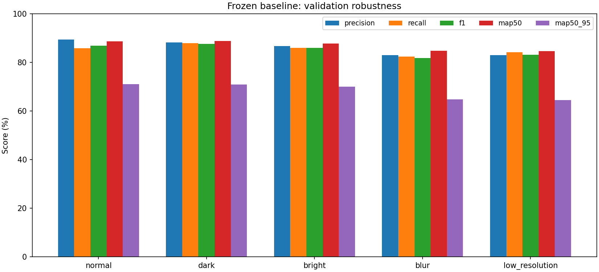
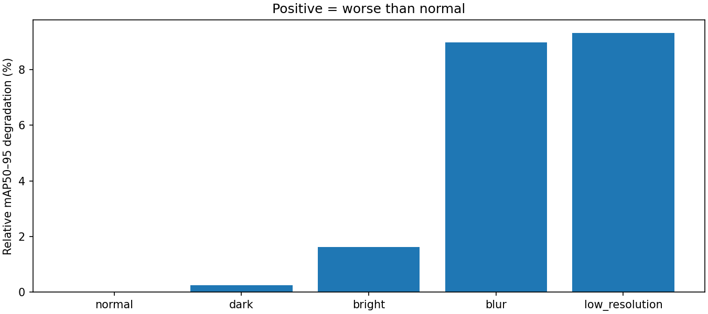
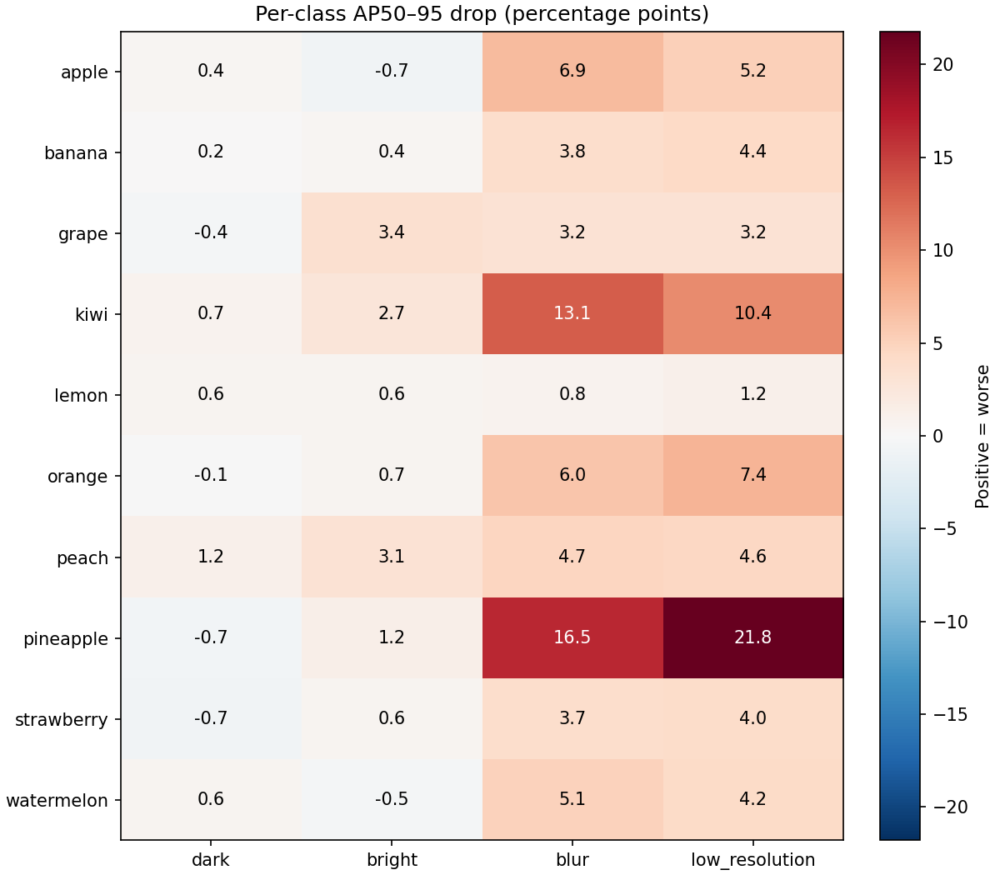

# FruitVision Robustness Results

## Scope and Protocol

Phase 2 evaluates **one frozen YOLO11n baseline** on the same **430 validation images and 880 annotated objects** under five fixed conditions. No model training, model selection, test-set evaluation, annotation correction, or threshold tuning was performed. This is a paired comparison: each source image and its labels occur once in every condition.

**These results are diagnostic because the source annotations are imperfect.** Incomplete fruit annotations and inconsistent box coverage can affect measured precision/recall and AP. This experiment measures sensitivity at the chosen severities; it does not establish a universal ranking of lighting, blur, and resolution effects.

Checkpoint: `outputs/training/fruitvision_baseline/weights/best.pt`.

- Checkpoint SHA-256: `52a50db1f0c3e7384040359887683bfdaa764ae996c72e87fd7f194064430d3c`.
- Source dataset SHA-256: `6a89fedd2e617b3b22cdef23043cf38c7f519bc09f585245a38284f156eadf04`.
- Both fingerprints were checked before and after; checkpoint and original images/labels remained unchanged.
- Device: Apple M2 MPS. Input size 640, batch 8, seed 42, workers 0, no test-time augmentation.
- Software: Python 3.13.5, Ultralytics 8.4.152, PyTorch 2.14.0, Pillow 10.4.0. Full environment is retained.
- Evaluation confidence floor 0.001, NMS IoU 0.7, maximum 300 detections/image. These settings are identical for every condition. NMS IoU controls suppression of overlapping predictions; it is different from the IoU thresholds used to score AP.
- Executed 16 September 2026 UTC. The run completed all five conditions; each has ten per-class metric rows and the same ground-truth counts.

## Fixed Transformations

The following settings were declared in `CONDITIONS` before evaluation. Each transformation starts from the original decoded RGB image, not from another condition.

| Condition | Transformation | Spatial handling |
| --- | --- | --- |
| Normal | Identity | Original decoded RGB pixels retained |
| Dark | Pillow brightness factor **0.5** | Intensity scaling only |
| Bright | Pillow brightness factor **1.5**, saturation clipped to 255 | Intensity scaling only |
| Blur | Pillow Gaussian blur **radius 2.0 source pixels** | Gaussian approximation, radius denotes standard deviation |
| Low resolution | **0.25× width and height**, BOX downsampling, BILINEAR upsampling | 384×384 → 96×96 → 384×384 |

All conditions are written as lossless PNG files, avoiding extra JPEG compression as a confound. Normal PNGs were checked against all 430 decoded original images and are pixel-identical. Every transformed image retains the original canvas dimensions and every label is copied byte-for-byte. No crop, rotation, or geometric translation occurs, so normalized bounding-box coordinates remain aligned. Upsampling restores dimensions but cannot recover discarded detail.

This is synthetic RGB brightness scaling, not a calibrated camera exposure model. Blur operates on the 384×384 source before YOLO resizing. The low-resolution condition reduces available detail while keeping the detector's input setting at 640; it is not an inference-size benchmark. Settings are not perceptually matched in severity across transformation types.

## Overall Results

Metric values are percentages. “Degradation” is a relative percentage, not a percentage-point difference.

| Condition | Precision | Recall | F1 | mAP50 | mAP50–95 | mAP50–95 degradation (%) |
| --- | ---: | ---: | ---: | ---: | ---: | ---: |
| normal | 89.36 | 85.77 | 86.78 | 88.55 | 71.08 | 0.00 |
| dark | 88.15 | 87.82 | 87.54 | 88.78 | 70.90 | 0.25 |
| bright | 86.69 | 85.97 | 85.99 | 87.73 | 69.93 | 1.62 |
| blur | 82.98 | 82.43 | 81.82 | 84.70 | 64.69 | 8.98 |
| low_resolution | 82.93 | 84.15 | 83.11 | 84.65 | 64.45 | 9.33 |



The same-run normal control matches the previously reported baseline validation metrics exactly at saved precision. All degradation calculations nevertheless use this experiment's normal control, not an independently chosen historical score.

### Metric definitions

Precision measures correct detections among reported detections; recall measures labeled objects found; F1 balances precision and recall. As in the existing evaluator, precision/recall/F1 are macro averages at Ultralytics' best-mean-F1 operating point **computed separately for each condition**. Overall F1 averages class F1 values and is not the harmonic mean of aggregate precision and recall. These values are conventional curve-derived evaluation summaries, not performance at one common deployment confidence threshold. No selected threshold was applied to later conditions or used to modify the model.

AP summarizes the precision–recall curve. mAP50 matches at IoU ≥0.50; mAP50–95 averages IoU 0.50–0.95. **mAP50–95 was the prespecified primary comparison**, because it accounts for both detection and localization over multiple overlap requirements.

## Degradation Versus Normal

```text
relative degradation (%) = 100 × (normal score − condition score) / normal score
percentage-point drop    = 100 × (normal score − condition score)
```

Positive values mean worse performance; negative values are retained as improvements. A zero normal score gives undefined relative degradation (`null`), not an invented percentage. CSV/JSON exports contain both measures for all aggregate and per-class metrics.

| Condition | Precision degradation % | Recall degradation % | F1 degradation % | mAP50 degradation % | mAP50–95 degradation % |
| --- | ---: | ---: | ---: | ---: | ---: |
| normal | +0.00 | +0.00 | +0.00 | +0.00 | +0.00 |
| dark | +1.36 | -2.40 | -0.88 | -0.26 | +0.25 |
| bright | +2.99 | -0.24 | +0.91 | +0.93 | +1.62 |
| blur | +7.14 | +3.89 | +5.72 | +4.35 | +8.98 |
| low_resolution | +7.20 | +1.88 | +4.23 | +4.41 | +9.33 |



**Low resolution is worst by mAP50–95:** 64.45%, down **6.63 percentage points / 9.33% relative** from normal. Blur follows closely at 64.69%, down 6.39 points / 8.98% relative. Their difference is only about **0.25 percentage points**; one run at one severity does not establish a statistically reliable or general ordering. Blur has the lowest F1, illustrating why the ranking metric must be specified in advance.

Darkening barely changes mAP50–95 (−0.18 points), while recall, F1, and mAP50 improve slightly. Brightening reduces mAP50–95 by 1.15 points. These small changes should not be interpreted as proof that a lighting intervention improves real deployment: operating-point shifts, image content, incomplete labels, and numerical variability can contribute.

## Per-Class Robustness

AP50–95 values below are percentages. Counts are the same for every condition. Complete Precision, Recall, F1, AP50, AP50–95, relative degradation, and percentage-point drops for all **50 class/condition combinations** are available in [per_class.csv](results/robustness/per_class.csv) and [results.json](results/robustness/results.json).

| ID | Class | Objects | Normal | Dark | Bright | Blur | Low resolution |
| --- | --- | ---: | ---: | ---: | ---: | ---: | ---: |
| 0 | apple | 54 | 59.88 | 59.51 | 60.63 | 52.94 | 54.66 |
| 1 | banana | 45 | 88.79 | 88.63 | 88.38 | 84.99 | 84.37 |
| 2 | grape | 79 | 40.74 | 41.10 | 37.31 | 37.58 | 37.55 |
| 3 | kiwi | 133 | 72.76 | 72.07 | 70.05 | 59.63 | 62.40 |
| 4 | lemon | 43 | 96.75 | 96.14 | 96.14 | 95.95 | 95.59 |
| 5 | orange | 90 | 53.47 | 53.60 | 52.81 | 47.43 | 46.08 |
| 6 | peach | 44 | 87.66 | 86.48 | 84.57 | 82.99 | 83.06 |
| 7 | pineapple | 59 | 70.95 | 71.61 | 69.70 | 54.45 | 49.16 |
| 8 | strawberry | 177 | 82.93 | 83.64 | 82.35 | 79.18 | 78.90 |
| 9 | watermelon | 156 | 56.85 | 56.22 | 57.35 | 51.80 | 52.68 |



The three largest AP50–95 percentage-point losses within each transformed condition are:

| Condition | Most affected classes |
| --- | --- |
| dark | peach −1.18 pp (1.34% relative); kiwi −0.69 pp (0.95% relative); watermelon −0.64 pp (1.12% relative) |
| bright | grape −3.43 pp (8.42% relative); peach −3.09 pp (3.53% relative); kiwi −2.71 pp (3.73% relative) |
| blur | pineapple −16.50 pp (23.26% relative); kiwi −13.14 pp (18.06% relative); apple −6.94 pp (11.59% relative) |
| low_resolution | pineapple −21.78 pp (30.70% relative); kiwi −10.36 pp (14.24% relative); orange −7.39 pp (13.81% relative) |

**Pineapple is most sensitive to lost detail in this experiment:** low resolution costs 21.78 points (30.70% relative) and blur costs 16.50 points (23.26%). Kiwi also loses substantially under both. Orange is third most affected by low resolution; apple is third under blur. This is evidence to investigate detail/box-localization sensitivity, not proof of its cause: size, texture, occlusion, and annotation quality are not isolated here. Brightening most affects grape at these settings. Frequency alone does not explain these class-specific changes.

## Reproduction and Output Files

From the project root with its environment activated:

```bash
python experiments/experiment_runner.py
python -m unittest discover -s tests -v
```

The runner defaults to the frozen baseline and validation only. The completed output is protected from overwriting; inspecting saved results does not require another evaluation. To intentionally reproduce later, provide a new `--output` directory. `--device cpu` is available, but cross-device results need not be numerically identical.

```text
outputs/experiments/robustness/
├── run_metadata.json          # fixed settings, versions, timestamps, fingerprints
├── environment.txt            # pip freeze
├── source_audit.json           # source validation and per-file fingerprints
├── results.json               # aggregate and per-class comparisons
├── overall.csv
├── per_class.csv
├── tests.txt
├── datasets/<condition>/      # separate PNG images, unchanged labels, manifest, YAML
├── evaluations/<condition>/   # real metrics.json, per_class.csv, native curves/predictions
└── figures/                   # aggregate, relative degradation, per-class charts
```

Per-condition YAML includes the `train` key required by Ultralytics' schema as an alias of the copied validation directory; these are **evaluation-only configurations**. The runner calls only `model.val(split="val")`, never `model.train()`. No test split appears in these configurations.

Small portfolio-friendly copies of the [aggregate CSV](results/robustness/overall.csv), [run metadata](results/robustness/run_metadata.json), [environment](results/robustness/environment.txt), and charts live under `docs/results/robustness/` and `docs/assets/robustness/`. Transformed datasets and large evaluation outputs remain excluded by the existing `.gitignore`. No new dependency was added.

## Verification and Limitations

- **46 tests passed**: all 36 existing tests plus 10 robustness tests. Tests cover intensity scaling/clipping, blur behavior, resolution changes, source preservation, label geometry/bytes, overwrite protection, degradation arithmetic, ground-truth count consistency, validation-only frozen-checkpoint orchestration, and CLI access. Temporary test fixtures are not model results.
- Each condition evaluated **430 images / 880 objects**, with all ten class IDs preserved.
- Before/after full source fingerprints and checkpoint hashes matched; original dataset and weights were not modified.
- Source labels remain imperfect, including unlabeled fruit and inconsistent crowded-scene coverage. Identical labels support paired comparison but do not remove this bias; fewer detections of unlabeled fruit can even improve measured precision.
- One fixed severity per condition and a single evaluation per condition provide no confidence intervals or isolated causal attribution. Small differences must be interpreted cautiously.
- MPS can contain nondeterministic operations; seeds and environment records provide traceability, not guaranteed bitwise repeatability across machines/runs.
- The validation set lacks mixed-class annotated scenes and is already used in project development. These are diagnostic validation findings, not new held-out test claims.
- This phase introduces no retraining, size estimation, or UI.

## Recommended Next Step

Review incomplete/inconsistent validation annotations in a separately versioned dataset first, preserving these baseline results. Then predefine a small **blur/resolution severity sweep** with the same frozen checkpoint on validation, focusing on pineapple and kiwi and checking whether missed/localized boxes account for their losses. Use an explicitly fixed confidence threshold for any future deployment-count comparison. Do not retrain or tune against test data on the basis of this diagnostic run alone.
